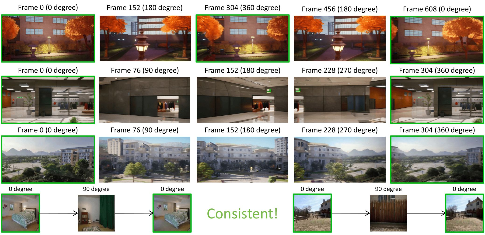
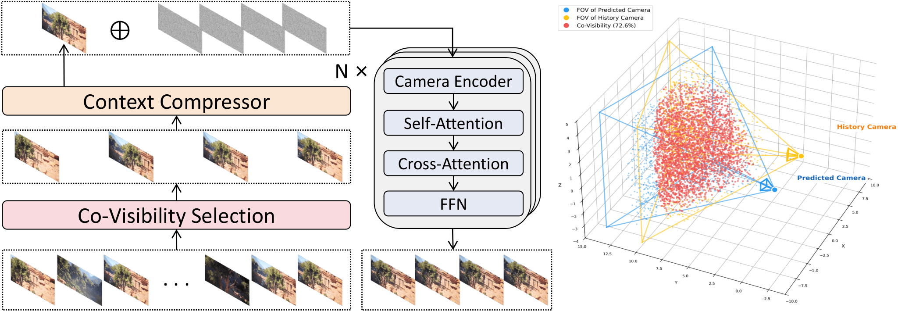

<div align="center">
  <h1>🎥MemCam🎥</h1>
  <h3>Memory-Augmented Camera Control for Consistent Video Generation</h3>
  <p>🎉<strong>IJCNN 2026</strong>🎉</p>
  <a href='#'></a> &nbsp;&nbsp;
  <a href='https://newhorizon2005.github.io/MemCam/'></a> &nbsp;&nbsp;
  <a href='https://huggingface.co/newhorizon2005/MemCam'></a> &nbsp;&nbsp;
</div>

## 📄 Paper

> **MemCam: Memory-Augmented Camera Control for Consistent Video Generation**  
> *Xinhang Gao, et al.*  
> *International Joint Conference on Neural Networks (IJCNN), 2026*

---

<p align="center">
   
</p>

---

## 🚀 Overview

Existing interactive video generation methods struggle to maintain scene consistency under large camera rotations over long time horizons — they either rely on fixed-length context windows that cannot cover distant viewpoints (e.g., DFoT), or introduce 3D reconstruction that inevitably accumulates errors (e.g., GeometryForcing).

**MemCam** addresses this by treating previously generated frames as **dynamically retrievable external memory**, enabling long-range scene consistency without 3D reconstruction. The framework is built on the Wan2.1 1.3B DiT and introduces two key designs:

- A **Context Compression Module** that encodes historical frames into compact representations via spatial 2× downsampling, reducing token count to 1/4 and achieving ~5× inference speedup with minimal quality loss.
- A **Co-Visibility-Based Context Retrieval** strategy that uses Monte Carlo FOV overlap estimation to dynamically select the most viewpoint-relevant historical frames for each predicted frame, rather than simply using the most recent ones.

<p align="center">
  
</p>

---

## ✨ Key Features

- 🧠 **External Memory Mechanism** – Maintains all historical frames as retrievable memory, enabling faithful scene reconstruction even after 360° camera rotations.
- 🎯 **Co-Visibility Retrieval** – Dynamically selects context frames based on camera FOV overlap, ensuring each predicted frame is conditioned on the most relevant history.
- ⚡ **Efficient Context Compression** – Compresses historical frame tokens to 1/4 via spatial downsampling, achieving ~5× speedup over uncompressed baselines at comparable quality.
- 📊 **Strong Results** – ~80% FVD reduction over the strongest baseline on 360° round-trip benchmarks; significant zero-shot gains on RealEstate10K.

---

## 🛠️ Installation

### 1. Clone the repository
```bash
git clone https://github.com/newhorizon2005/MemCam.git
cd MemCam
```

### 2. Create conda environment
```bash
conda create -n memcam python=3.10 -y
conda activate memcam
```

### 3. Install DiffSynth-Studio

MemCam is built on a modified version of DiffSynth-Studio, which is included in this repository.
```bash
pip install -e .
```

### 4. Download Wan2.1 base model
```bash
python utils/download_wan2.1.py
```

This will download the Wan2.1-T2V-1.3B base model to `models/Wan-AI/Wan2.1-T2V-1.3B`.

### 5. Download MemCam weights
```bash
huggingface-cli download newhorizon2005/MemCam --local-dir models/MemCam
```

---

## 🎬 Inference

### Quick Start

We provide a demo script for quick inference:
```bash
python demo.py
```

### Manual Inference
```bash
python inference_memcam.py \
    --input_image \
    --pose_path \
    --prompt 
```

---

## 🏋️ Training

### 1. Download dataset

We train on the [Context-as-Memory](https://github.com) dataset.
```bash
# Download and extract
huggingface-cli download <dataset_repo> --local-dir data/context-as-memory --repo-type dataset
```

### 2. Preprocess dataset
```bash
python scripts/preprocess.py \
    --data_dir data/context-as-memory \
    --output_dir data/processed
```

### 3. Train
```bash
python train.py \
    --data_dir data/processed \
    --base_model_path models/Wan2.1-T2V-1.3B \
    --output_dir checkpoints/ \
    --batch_size 16 \
    --lr 1e-5 \
    --max_steps 20000
```

---

## 🙏 Acknowledgements

This work is supported by the **National Innovation Training Program for College Students** of Guilin University of Electronic Technology (Grant No. 202510595051).

We thank the authors of [Wan2.1](https://github.com/Wan-Video/Wan2.1), [DiffSynth-Studio](https://github.com/modelscope/DiffSynth-Studio), [Context-as-Memory](https://github.com/hehao13/CaM), [DFoT](https://github.com/kwsong0113/diffusion-forcing-transformer), and [GeometryForcing](https://github.com/wuhaozhe/geometry-forcing) for their excellent work.

---

## 📝 Citation

If you find this work useful, please consider citing:
```bibtex
@inproceedings{gao2026memcam,
  title     = {MemCam: Memory-Augmented Camera Control for Consistent Video Generation},
  author    = {Gao, Xinhang and Guan, Junlin and Luo, Shuhan and Li, Wenzhuo and Tan, Guanghuan and Wang, Jiacheng},
  booktitle = {International Joint Conference on Neural Networks (IJCNN)},
  year      = {2026}
}
```
